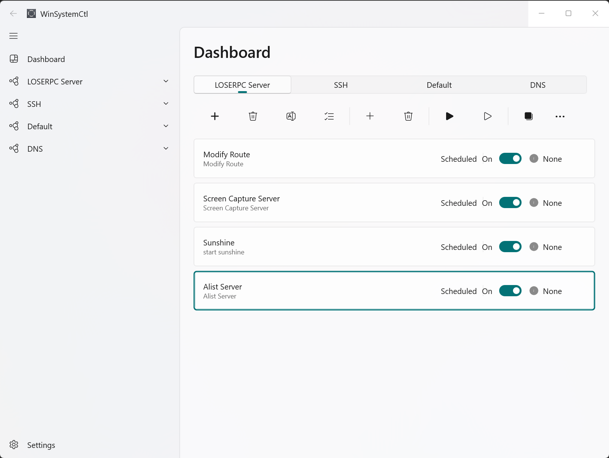
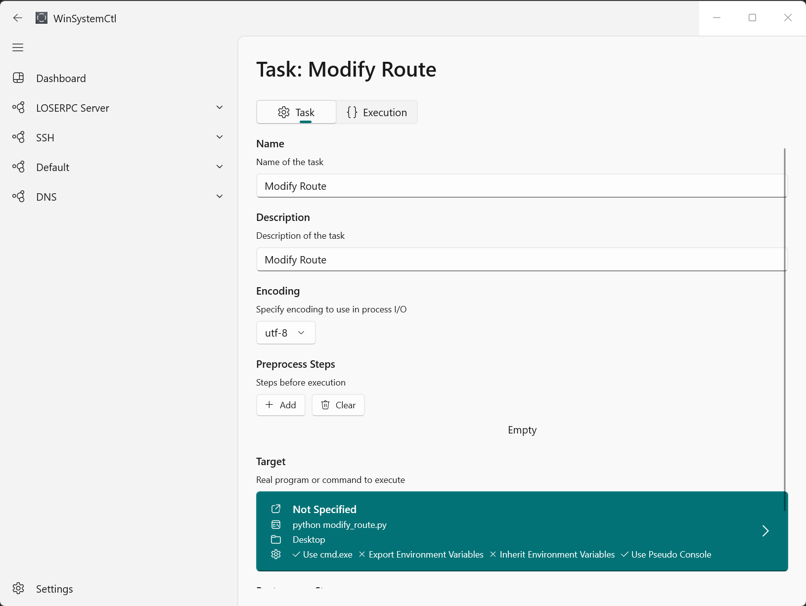
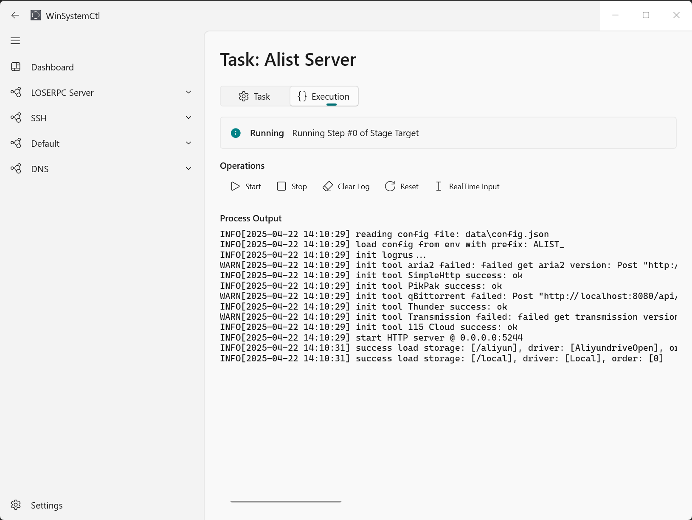

## WinSystemCtl

An application that helps you manage some automated tasks (usually command line) with a modern appearance, using WinUI 3 as the graphics framework.

### Design

**A "Task":**

- **Single Step**: Invoke a command or run a process with arguments.
- **Preprocess Steps**: Several *single steps* before executing the "Target" step;
- **Target**: The one *single step* to be executed and monitored;
- **Postprocess Steps**: Several *single steps* after executing the "Target" step;

**Features:**

- Environment variables passed between adjacent *single steps*;
- Piped input and output between adjacent *single steps*;
- Grouping of multiple tasks, making it easier to manage;

### Project

**Overview**:

- **WinSystemCtl.PseudoConsoleCore**: Core functional module for creating, managing, and monitoring multiple pseudo-terminal sessions for WinSystemCtl app.
- **WinSystemCtl.Core**: Core definitions and functions of executing tasks;
- **WinSystemCtl**: GUI of application;

**Future Plan**:

- Remote support.

### Build & Run

1. Build `WinSystemCtl`；
2. Build `WinSystemCtl.PseudoConsoleCore`：using cmake + MSVC + ninja；
   - The `libPseudoConsoleCore.dll` will be automatically copied to build folder of `WinSystemCtl`；
   - You can modify the `DLL_INSTALL_PATH` in `CMakeLists.txt` to change the destination folder；
3. Launch `WinSystemCtl` for Debug or Release；

### ScreenShots

### Dependencies

Special thanks to (open source) projects below:

|              Project              |                   Website                   |
| :-------------------------------: | :-----------------------------------------: |
|     CommunityToolkit.Windows      | https://github.com/CommunityToolkit/Windows |
|         Microsoft.CsWin32         |    https://github.com/Microsoft/CsWin32     |
| Microsoft.WindowsAppSDK (WinUI 3) | https://github.com/microsoft/windowsappsdk  |
|          Newtonsoft.JSON          |       https://www.newtonsoft.com/json       |
|      CommunityToolkit.Common      | https://github.com/CommunityToolkit/dotnet  |

